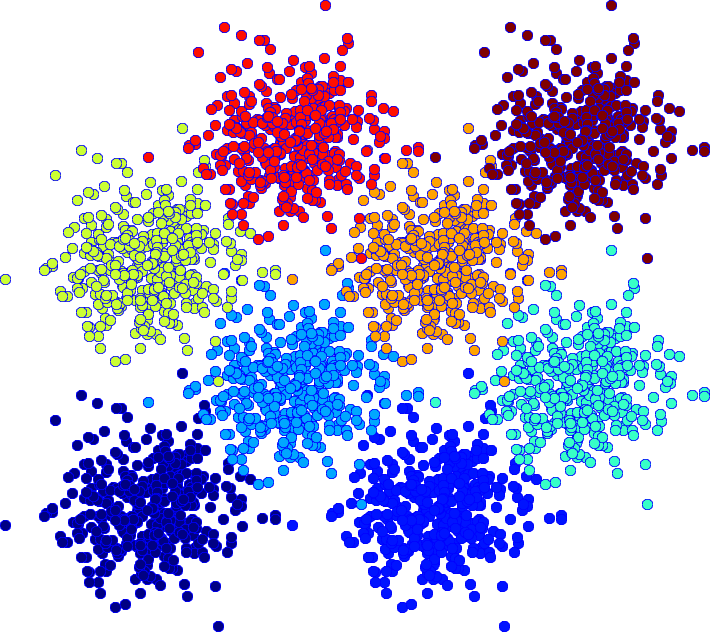
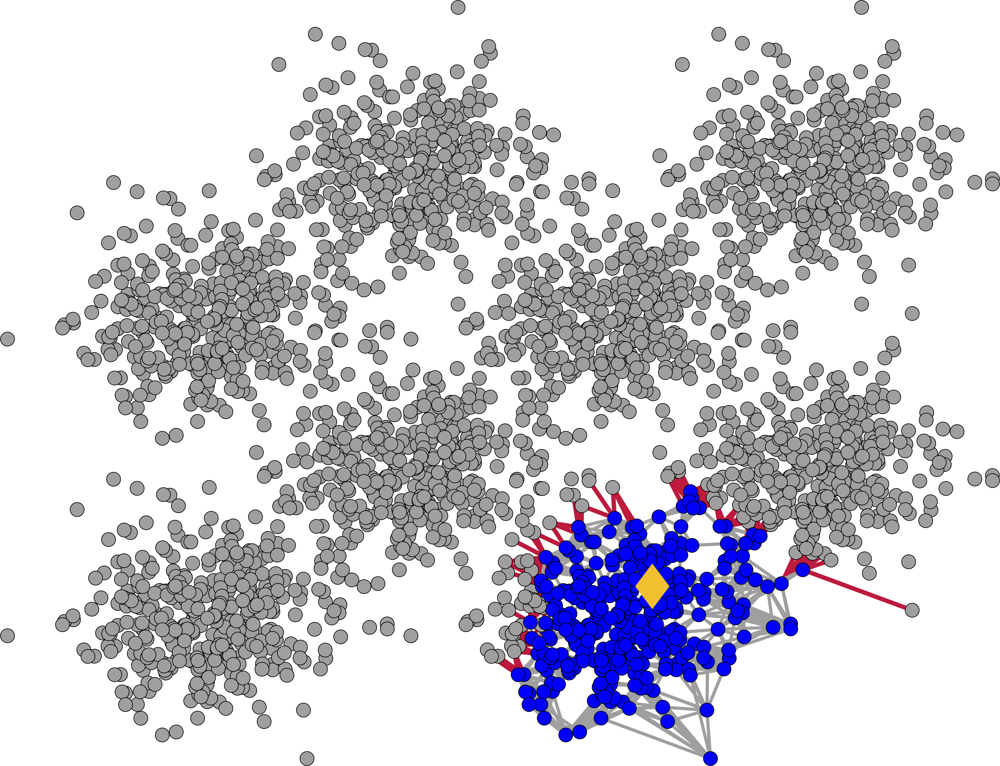
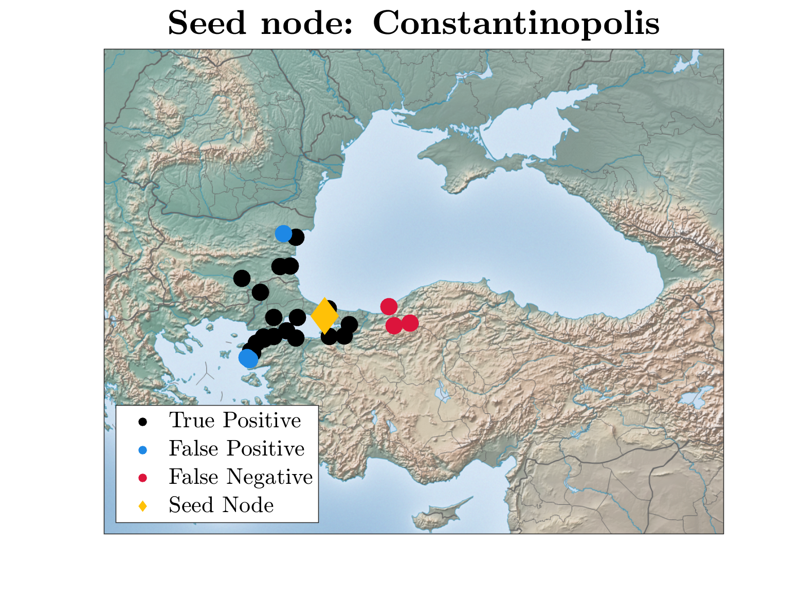
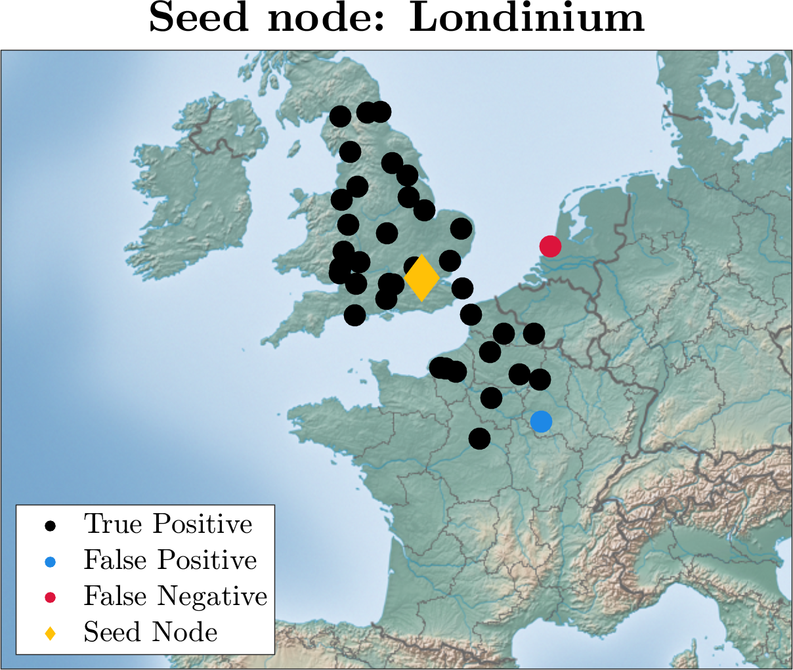
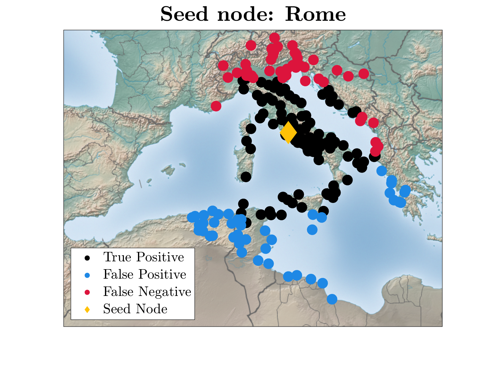

## Nonlinear modified PageRank problem for local graph partitioning

This repository contains the official code for the paper "*Nonlinear modified PageRank problem for local graph partitioning*", available online at [ARXIV link](https://arxiv.org/).

<p align="center">
  
  
</p>
<center>
In this work, we developed a new method for local graph partitioning based on a nonlinear generalisation of the PageRank problem involving the Moore-Penrose inverse of the incidence matrix. The Levenberg-Marquardt method is used with a full rank Jacobian variant to obtain a numerical solution to the generalised problem. Sets of vertices are formed according to the ranking supplied by the solution, and a conductance criterion decides upon the set that best represents the local cluster around a starting vertex. Experiments on both synthetic and real-world inspired graphs demonstrate the capability of the approach to not only produce low conductance sets, but to also recover local clusters with an accuracy that consistently surpasses state-of-the-art algorithms.
</center>

<!-- [](https://zenodo.org/badge/latestdoi/541179044) -->

### Motivation & contributions

This work takes the system of linear equations that forms the PageRank problem as the starting point in the construction of a local clustering algorithm. Only clusters around a
single vertex are considered. we study a modification to the PageRank problem, and the theoretical motivation for a nonlinear generalisation involving the p-norm. The Moore-Penrose inverse of the incidence matrix plays a very important role in this generalisation, that can reduce to a system of linear equations closely resembling the original modified PageRank problem. However, this is dependent on a number of conditions, with a major one being that the number of vertices approaches infinity. Additionally, an insight into the effect of the generalised problem on the cluster criterion based on an infinitesimal perturbation argument is offered. The Levenberg-Marquardt method with a full rank Jacobian variant is employed for obtaining a numerical solution to the generalised problem.
  
### Requirements
Our code uses and adapts the Levenberg-Marquardt implementation from [immoptibox](http://www2.imm.dtu.dk/projects/immoptibox/).
The necessary paths are included in the script [`addpaths_NPR.m`](src/addpaths_NPR.m). The code has been tested in Mac and Ubuntu distributions. All the algorithms are implemented in MATLAB R2021b. 

### Input data
The complete list of the datasets used in this study can be found in this [permalink](https://drive.switch.ch/index.php/s/PEnKOcOYEWUILap). A small subset of this data is stored in [`Input/`](Input/).

### Usage

The main script [`Benchmark_NPR.m`](src/Benchmark_NPR.m) runs the experiments on the input data. For the [ORBIS](https://orbis.stanford.edu/) real-world experiment use the script [`Benchmark_NPR_Orbis.m`](src/Benchmark_NPR_Orbis.m).

**Run**: To perform local graph clustering on the available input data include the desired dataset in ``cases{}`` (Line 16), and type in the matlab command line
```
>> cd src/
>> Benchmark_NPR
```
or 
```
>> cd src/
>> Benchmark_NPR_Orbis
```

The following parameters (Lines 30 - 38) control important features of the algorithm:
```
print_level          = 2;     % 0/1/2 for no print/low/high verbosity
p_levels             = [1.95; 1.9; 1.8; 1.7; 1.6; 1.5; 1.45]; % levels of p
% β = (1 - α)/α, where α is the teleportation constant
beta               = 0.01;      % for majority of cases
num_trials           = 10;      % number of different seed nodes
norm_Lap             = 2;       % 0/1/2 for combinatorial/norm. symmetric/random walk Laplacian
write_output_to_file = false;   % write output to file
```
**Output**: The output is printed in the command window for each case under question, or saved to a file if ``write_output_to_file = true``. It includes the index of the seed node (s_node), the value of p at which the best partitioning was found (best_p), the values of the best conductance (RCCut) and F-score, and the elapsed time in sec. of the NPR algorithm per srating node. Mean results are then displayed with standard deviation based on all the seed vertices. The ORBIS experiments have additional visual output, illustrating the classification of the Roman settlements on the map. An example is offered below.

<p align="center">
  <div style="display: flex; justify-content: center;">
    
    
    
  </div>
</p>

#### Code Structure

The structure of the files in this repository is as follows:
```
├── Input                       # input graphs in .mat format
├── immoptibox                  # DTU toolbox (modified) with functions for optimization and data fitting
├── src                         # source code of the paper
├── src/Optimization            # objective, Jacobian, and Hessian computations
├── src/Metrics                 # evaluation of the clustering results
├── src/Graph_Construction      # graph generation code
├── src/Visualization           # graph visualization code and some figures
```

Further details are documented within the code.

### Maintainers
- [Dimosthenis Pasadakis](https://dmspas.github.io/) ([dimosthenis.pasadakis@usi.ch](mailto:dimosthenis.pasadakis@usi.ch))
- [Costy Kodsi](https://vbn.aau.dk/da/persons/costyk) ([costyk@math.aau.dk](mailto:costyk@math.aau.dk))


### Citation

```
@article{KoPa2024,
author={Kodsi, C. and Pasadakis, D.},
title={Nonlinear modified {PageRank} problem for local graph partitioning},
year      = {2024},
journal   = {arXiv},
volume    = {XXX},
eprint    = {XXX},
primaryClass = {XXX},
archivePrefix = {arXiv},
url       = {https://arxiv.org/XXX}
}
```
